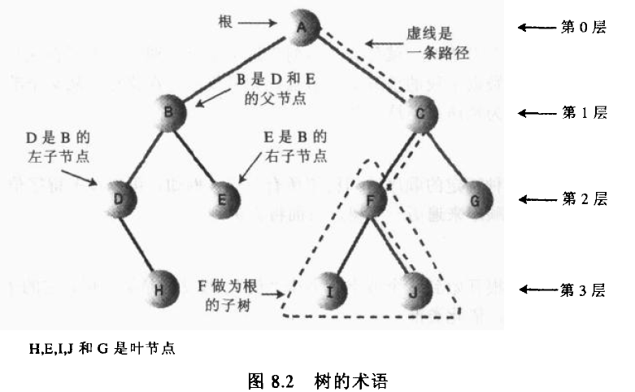

##一些概念

深度 对于节点n，从根到节点n的唯一路径的长

高度 对于节点n，从节点n到一片树叶的最长路径的长

几个公式：

n0 + n1 + n2 = n

0 * n0 + 1 * n1 + 2 * n2 + 1 = n

##术语

1. 节点的度：一个节点含有的子树的个数称为该节点的度；

1. 叶节点或终端节点：度为0的节点称为叶节点；

1. 非终端节点或分支节点：度不为0的节点；

1. 双亲节点或父节点：若一个节点含有子节点，则这个节点称为其子节点的父节点；

1. 孩子节点或子节点：一个节点含有的子树的根节点称为该节点的子节点；

1. 兄弟节点：具有相同父节点的节点互称为兄弟节点；

1. 树的度：一棵树中，最大的节点的度称为树的度；

1. 节点的层次：从根开始定义起，根为第1层，根的子节点为第2层，以此类推；

1. 树的高度或深度：树中节点的最大层次；

1. 堂兄弟节点：双亲在同一层的节点互为堂兄弟；

1. 节点的祖先：从根到该节点所经分支上的所有节点；

1. 子孙：以某节点为根的子树中任一节点都称为该节点的子孙。

1. 森林：由m（m>=0）棵互不相交的树的集合称为森林；

1. 路径 n1 -> nk  前一个都是后一个的父节点

##查找二叉树

一棵树的所有节点的深度和称为内部路径长

